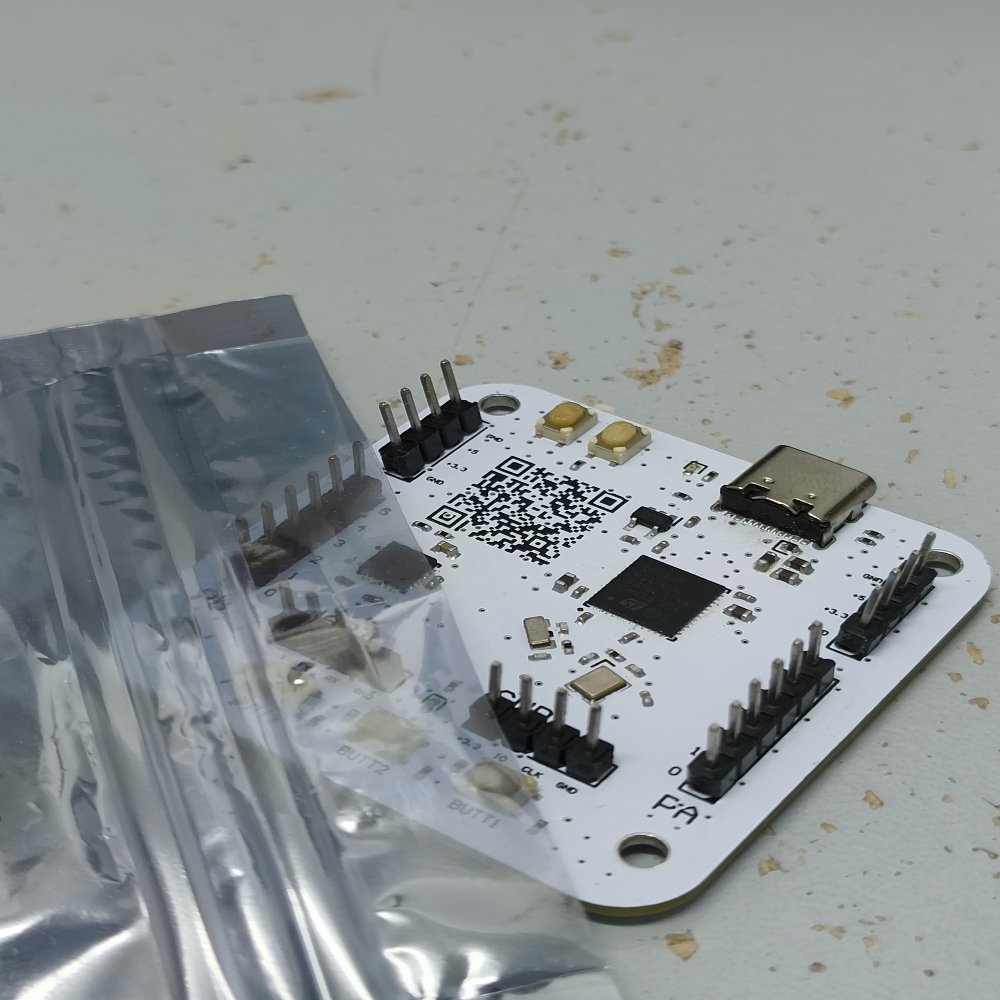
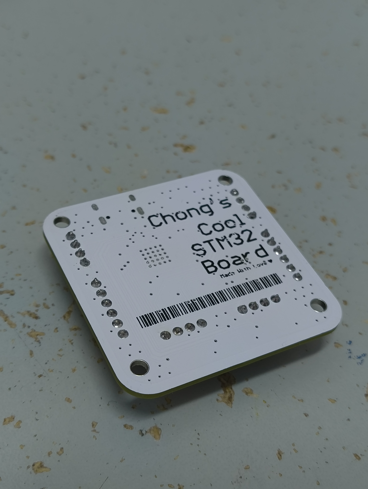
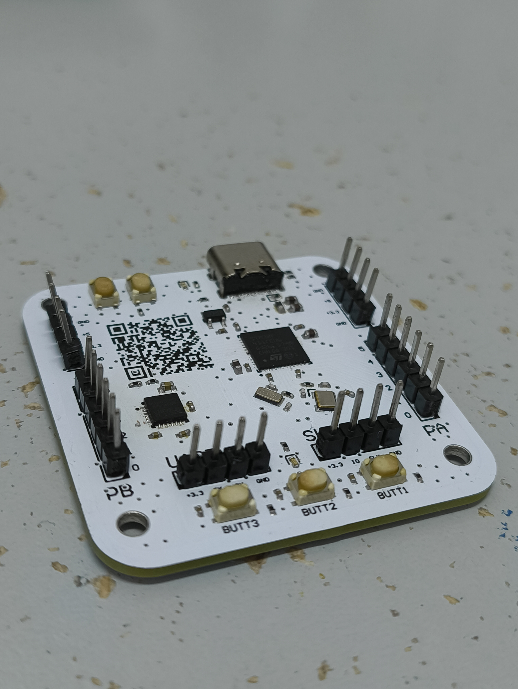
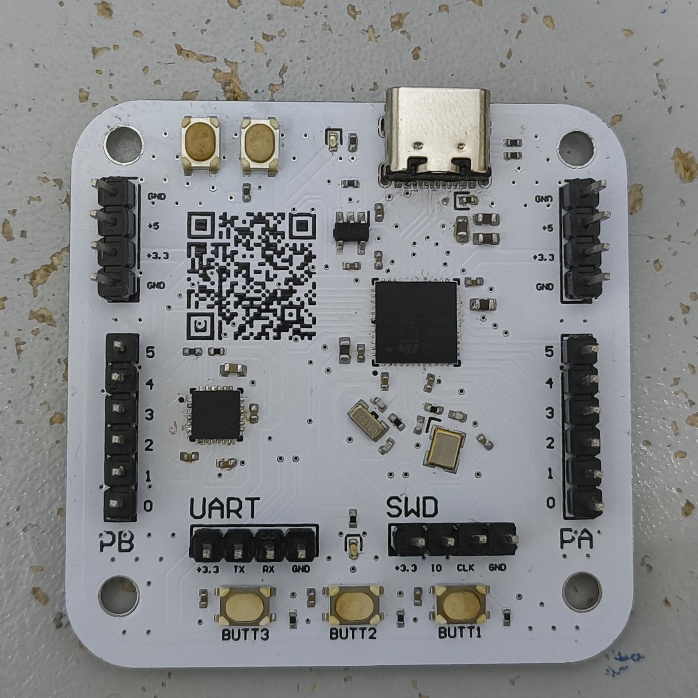

# Chongs-Cool-STM32-Board

This is my own custom STM32F411CEU6 Board made as an exercise for learning how to make proper PCB boards

This board contains 3 buttons, a MPU-6050 connected up through I2C, USB-C connector for power and data, and in total 12 GPIO pins

## Pictures

**Final Assembled PCB** ||||
---|---|---|:---:
|||

**Title** | **Picture**
---|:---:
Full Schematic |
Main MCU |
MPU-6050 |
Power Circuits |
PCB Overview |
PCB Top Layer |
PCB Bottom Layer |
3D Top View |
3D Bottom View |
3D Top View with Full Silkscreen |
3D Bottom View with Full Silkscreen |
